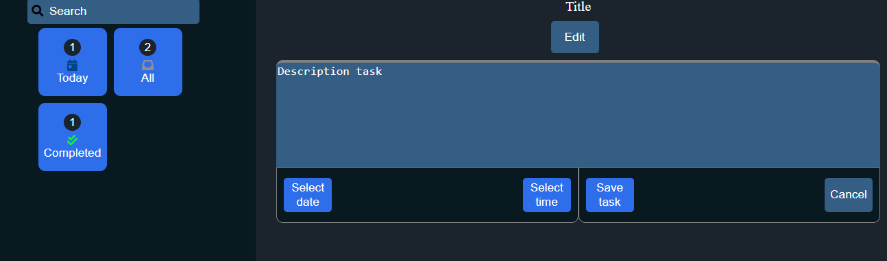

# 📝 ToDo List

A simple task manager built with **HTML**, **CSS/SCSS**, and **JavaScript**, allowing users to add, complete, and delete tasks with persistent storage using `localStorage`.

---

## 🚀 Live Demo

Check out the live app here:  
👉 [ToDo List - GitHub Pages](https://eddieramirez29.github.io/toDoList/)

---

## ✅ Features

- Add tasks
- Mark tasks as completed
- Delete tasks
- Persist data using `localStorage`
- Responsive design (mobile and desktop)
- Custom styling with SCSS

